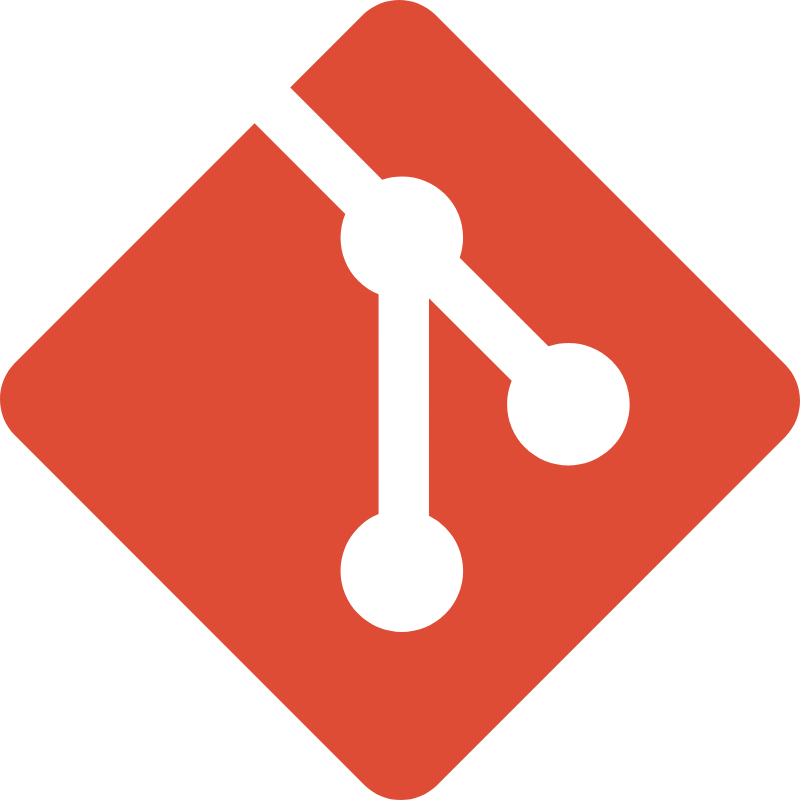

#  kodluyoruzilkrepo: Merve Akbulut'un İlk Git ve GitHub Deneyimi

Bu depo, **Kodluyoruz** ve **Patika.dev** işbirliği ile hazırlanan Git eğitimi kapsamında, **Merve Akbulut** tarafından oluşturulmuş ilk versiyon kontrol projesidir.

Projenin temel amacı, bir yazılımcının en önemli araçlarından biri olan **Git** versiyon kontrol sistemi ve popüler depo barındırma platformu **GitHub**'ı uygulamalı olarak öğrenmek ve pekiştirmektir.

---

##  Ödev Kapsamındaki Gereksinimler ve Uygulanan Adımlar

Bu projede aşağıdaki Git ve GitHub işlemleri başarılı bir şekilde tamamlanmıştır:

### GitHub Üzerindeki Ayarlar:
* **Depo Adı:** `kodluyoruzilkrepo`
* **Açıklama:** `Kodluyoruz Eğitimi kapsamında açtığım ilk repo`
* **Görünürlük:** Public
* **Lisans:** MIT License ile lisanslandı.
* Başlangıçta `README.md` dosyası otomatik olarak eklendi.

### Yerel Ortamda Uygulanan Git Komutları ve İçerikler:
* Depo, yerel bilgisayara klonlandı (`git clone`).
* Proje klasörüne bir adet `index.html` dosyası oluşturuldu.
* `README.md` dosyası, Markdown syntax'ı (başlıklar, listeler, görsel) kullanılarak detaylı bir şekilde düzenlendi.
* Tüm değişiklikler Git ile takip edildi (`git add .`), kaydedildi (`git commit -m "..."`) ve başarılı bir şekilde GitHub'a gönderildi (`git push`).

## 🛠 Kullanılan Teknolojiler

* **Git:** Versiyon Kontrol Sistemi.
* **GitHub:** Uzak depo barındırma platformu.
* **Markdown:** README dosyasını hazırlamak için kullanılan biçimlendirme dili.
* **HTML5:** Ödev gereği projeye dahil edilen dosya tipi.

---

##  Proje Görseli

Projenin bir görseli aşağıda gösterilmektedir.

## 📌 Lisans Bilgisi

Bu proje, **MIT Lisansı** altında yayımlanmıştır. Detaylı bilgi için repodaki `LICENSE` dosyasına bakabilirsiniz.      